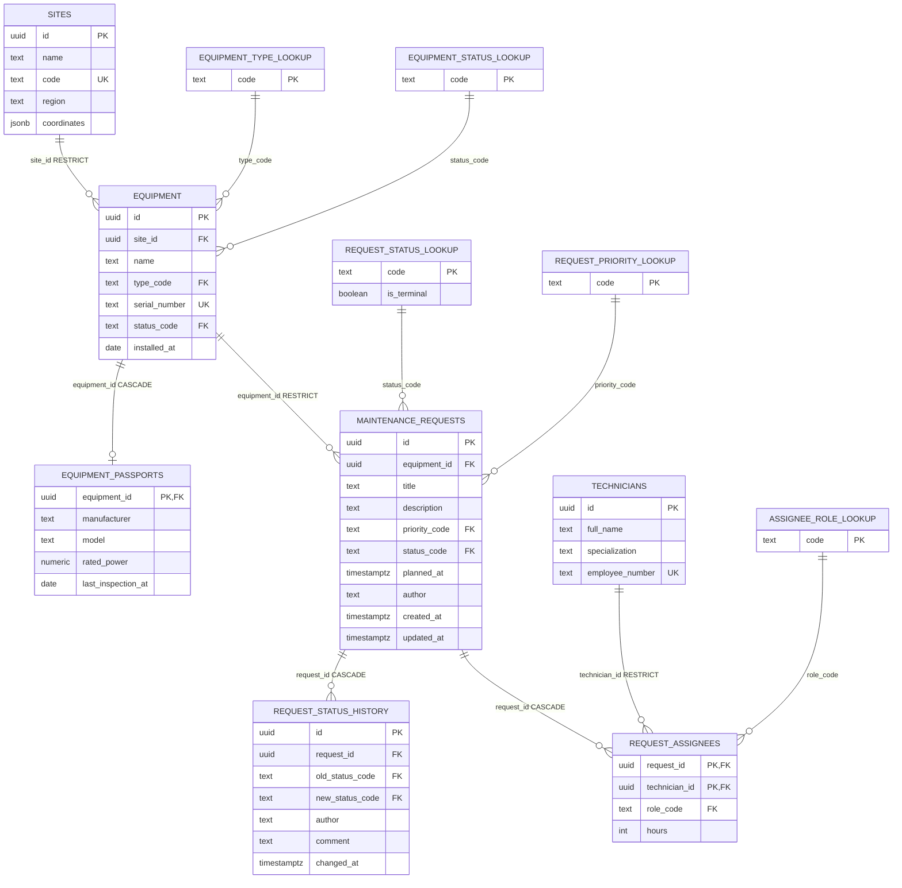

# Technical Service

REST API на Express для учёта оборудования производственной площадки (ветропарка) и заявок на его техническое обслуживание. Сервис ведёт справочник оборудования, контролирует жизненный цикл заявки через машину переходов статусов и позволяет оценить погодные условия на объекте перед планированием наружных работ.

Данные хранятся в JSON-файлах на диске (`storage/`), доступ к ним изолирован за слоем репозитория — замена хранилища на Postgres в дальнейшем не затронет сервисы и контроллеры.

## Содержание

- [Требования к окружению](#требования-к-окружению)
- [Установка и запуск](#установка-и-запуск)
- [Переменные окружения](#переменные-окружения)
- [Состав API](#состав-api)
- [Модель данных](#модель-данных)
- [Формат ответа об ошибке](#формат-ответа-об-ошибке)
- [Коды ответов](#коды-ответов)
- [Примеры запросов](#примеры-запросов)
- [Безопасность](#безопасность)
- [Логирование](#логирование)
- [Погода](#погода)
- [Массовый импорт заявок](#массовый-импорт-заявок)
- [Тестирование](#тестирование)
- [Структура проекта](#структура-проекта)
- [Git](#git)
- **[Кейс 3: перенос на PostgreSQL](#кейс-3-перенос-на-postgresql)**
  - [Схема данных и связи](#схема-данных-и-связи)
  - [ER-диаграмма](#er-диаграмма)
  - [Миграции и роль приложения](#миграции-и-роль-приложения)
  - [Сиды и перенос данных из Кейса 2](#сиды-и-перенос-данных-из-кейса-2)
  - [Модели и ассоциации](#модели-и-ассоциации)
  - [Транзакции](#транзакции)
  - [Новые эндпоинты](#новые-эндпоинты)
  - [SQL-отчёты](#sql-отчёты)
  - [Защита от SQL-инъекций](#защита-от-sql-инъекций)
  - [Переменные окружения БД](#переменные-окружения-бд)
  - [Запуск и откат миграций](#запуск-и-откат-миграций)

## Требования к окружению

- Node.js 20.6+ (используется нативный флаг `--env-file`, без `dotenv`)
- pnpm

## Установка и запуск

```bash
pnpm install
cp .env.example .env
pnpm dev
```

`pnpm dev` — с автоперезапуском при изменении файлов. `pnpm start` — без него.

### Через Docker

```bash
cp .env.example .env
docker compose up --build
```

Контейнер всегда стартует с `NODE_ENV=production` (задано прямо в `docker-compose.yml`, поверх значения из `.env`) — это отключает цветной dev-лог (`pino-pretty` — devDependency, в проде не устанавливается) и скрывает внутренние детали ошибок в ответах API. `storage/` монтируется томом с хоста, поэтому данные переживают пересоздание контейнера. Порт пробрасывается из `PORT` в `.env` (по умолчанию 3000).

### Прочие команды

| Команда | Назначение |
|---|---|
| `pnpm test` | прогнать тесты (Vitest + Supertest) |
| `pnpm test:watch` | тесты в watch-режиме |
| `pnpm typecheck` | проверка типов (`tsc --noEmit`) |
| `pnpm lint` / `pnpm format` | проверка / автофикс стиля (Biome) |

Перед каждым коммитом `lefthook` автоматически прогоняет `typecheck` и `test`.

## Переменные окружения

| Переменная | Назначение | Значение по умолчанию (в коде) |
|---|---|---|
| `PORT` | порт сервера | `3000` |
| `NODE_ENV` | окружение (`development`/`test`/`production`) | `development` |
| `CORS_ORIGINS` | список разрешённых источников через запятую | `` (пусто — см. раздел "Безопасность") |
| `RATE_LIMIT_WINDOW_MS` | окно rate-limit в мс | `60000` |
| `RATE_LIMIT_MAX` | максимум запросов на `/api` за окно | `100` |
| `WEATHER_API_URL` | базовый URL погодного API (Open-Meteo) | `https://api.open-meteo.com/v1` |
| `REQUEST_TIMEOUT_MS` | таймаут запроса к внешнему API | `5000` |
| `API_KEY` | ключ для заголовка `X-API-Key` на мутирующих операциях | `dev-api-key` |

Все переменные валидируются при старте через Zod-схему (`src/config/env.ts`) — при некорректном значении сервер не запустится, а не упадёт где-то посередине выполнения.

## Состав API

| Метод | Путь | Назначение |
|---|---|---|
| GET | `/api/health` | проверка доступности сервиса |
| GET | `/api/equipment` | список оборудования: фильтры (`status`, `type`), сортировка, пагинация |
| POST | `/api/equipment` | создание единицы оборудования |
| GET | `/api/equipment/:id` | карточка оборудования |
| PATCH | `/api/equipment/:id` | частичное обновление |
| DELETE | `/api/equipment/:id` | удаление (запрещено при наличии незакрытых заявок — 409) |
| GET | `/api/equipment/:id/requests` | заявки по конкретной единице оборудования |
| GET | `/api/equipment/:id/weather` | прогноз погоды по координатам объекта + признак пригодности окна для наружных работ |
| GET | `/api/requests` | список заявок: фильтры (`status`, `priority`, `equipmentId`, `dateFrom`/`dateTo`), сортировка, пагинация |
| POST | `/api/requests` | создание заявки |
| POST | `/api/requests/bulk` | массовый импорт заявок с частичным успехом (`207`, отчёт по каждой записи) |
| GET | `/api/requests/:id` | карточка заявки |
| PATCH | `/api/requests/:id` | редактирование полей заявки (`title`, `description`, `priority`, `plannedAt`) |
| PATCH | `/api/requests/:id/status` | смена статуса заявки с проверкой допустимости перехода |
| DELETE | `/api/requests/:id` | удаление заявки |

Список/пагинация — общий контракт для `equipment` и `requests`: ответ содержит `{ data, total, page, limit }`.

## Модель данных

### Оборудование (`equipment`)

| Поле | Тип | Примечание |
|---|---|---|
| `id` | `string` | uuid, генерируется сервером |
| `name` | `string` | 3–100 символов, обязательное |
| `type` | `turbine \| inverter \| sensor \| substation` | |
| `serialNumber` | `string` | уникален в пределах системы |
| `location` | `{ lat: number, lon: number }` | |
| `status` | `operational \| maintenance \| fault \| decommissioned` | |
| `installedAt` | `string` (ISO-дата) | не в будущем |

### Заявка на обслуживание (`request`)

| Поле | Тип | Примечание |
|---|---|---|
| `id` | `string` | uuid, генерируется сервером |
| `equipmentId` | `string` | ссылка на существующее оборудование |
| `title` | `string` | 5–120 символов, обязательное |
| `description` | `string?` | до 2000 символов, необязательное |
| `priority` | `low \| medium \| high \| critical` | |
| `status` | `new \| in_progress \| done \| rejected` | по умолчанию `new` |
| `plannedAt` | `string?` (ISO-дата-время) | необязательное |
| `createdAt` / `updatedAt` | `string` (ISO-дата-время) | проставляются сервером |

Поля `id`, `createdAt`, `updatedAt` (и `status` при создании) недоступны для изменения через API — клиент не может их переопределить. Неизвестные поля тела запроса тихо отбрасываются (используется `z.object`, а не `z.strictObject` — задание прямо требует именно игнорировать неизвестные поля, а не отклонять запрос ошибкой).

### Переходы статуса заявки

```
new ──────▶ in_progress ──────▶ done
 │                │
 └──────▶ rejected ◀─────┘
```

Допустимо: `new → in_progress`, `new → rejected`, `in_progress → done`, `in_progress → rejected`. Из `done` и `rejected` переходов нет. Смена статуса — только через `PATCH /api/requests/:id/status`; обычный `PATCH /api/requests/:id` статус не принимает. Недопустимый переход → `409`.

## Формат ответа об ошибке

Все ошибки API возвращаются в едином формате — [RFC 9457, Problem Details for HTTP APIs](https://www.rfc-editor.org/rfc/rfc9457.html):

```json
{
  "type": "https://example.com/problems/not_found",
  "title": "Заявка не найдена",
  "status": 404,
  "instance": "/api/requests/unknown-id",
  "requestId": "b1f2c3d4-...",
  "errors": [{ "field": "priority", "code": "invalid_enum_value", "message": "..." }]
}
```

`errors` присутствует только у ошибок валидации и содержит конкретное поле/причину. `requestId` есть всегда — по нему можно найти запись в логах.

**Почему RFC 9457, а не формат, буквально показанный в задании как пример.** Формулировка задания — "единый формат, **например**": то есть требование в том, чтобы формат был **единый по всему API**, а не в конкретном наборе ключей. RFC 9457 — признанный IETF-стандарт с готовой семантикой (`type` — machine-readable идентификатор проблемы, `instance` — конкретный URI, `status` — дублирует HTTP-код для удобства клиента), а не самодельная структура. Выбран сознательно вместо примера из задания.

## Коды ответов

`200`, `201` (с заголовком `Location`), `204`, `207` (массовый импорт заявок — частичный успех), `400` (синтаксически некорректное тело запроса (битый JSON), а также любая ошибка валидации **query-параметров** — недопустимое значение `limit`/`page`/`sort`/фильтров), `401` (отсутствующий/неверный `X-API-Key` на мутирующей операции), `403` (CORS), `404`, `409` (конфликт: дубль `serialNumber`, недопустимый переход статуса, удаление оборудования с открытыми заявками), `422` (ошибка валидации **тела запроса или params** — бизнес-правила, Zod-схемы для `body`, невалидный uuid в пути), `429` (rate limit), `503` (внешний погодный API недоступен).

`query` разведён с `body`/`params` по разным кодам сознательно: `middlewares/validate.ts` возвращает `BadRequestError` (400) для `query` и `ValidationError` (422) для `body`/`params` — это отдельно требуется для `limit`/`offset` в Кейсе 3 («значения вне диапазона отклоняются с кодом 400») и распространено на остальные query-фильтры для единообразия внутри одного эндпоинта.

## Примеры запросов

### Создание оборудования — успех

```
POST /api/equipment
Content-Type: application/json
X-API-Key: dev-api-key

{
  "name": "Турбина №1",
  "type": "turbine",
  "serialNumber": "WT-0001",
  "location": { "lat": 55.75, "lon": 37.62 },
  "status": "operational",
  "installedAt": "2024-01-01T00:00:00.000Z"
}
```
→ `201 Created`, заголовок `Location: /api/equipment/{id}`, тело — созданный объект с `id`.

### Создание оборудования — ошибка валидации

```
POST /api/equipment
{ "name": "АБ", ... }
```
→ `422`:
```json
{
  "type": "https://example.com/problems/validation_failed",
  "title": "Ошибка валидации",
  "status": 422,
  "errors": [{ "field": "name", "code": "too_small", "message": "Too small: expected string to have >=3 characters" }]
}
```

### Недопустимый переход статуса

```
PATCH /api/requests/{id}/status
{ "status": "new" }
```
(если заявка уже в `in_progress`) → `409`:
```json
{ "title": "Недопустимый переход статуса: in_progress → new", "status": 409 }
```

Полный набор сценариев (включая 404/409/429 и happy path каждого эндпоинта) — в Postman-коллекции, `docs/postman/`.

## Безопасность

- **CORS** — явный allow-list источников из `CORS_ORIGINS` (через запятую), не `*`. Запрос без заголовка `Origin` (curl, Postman, server-to-server) пропускается всегда; запрос с `Origin`, которого нет в списке — `403`. По умолчанию `CORS_ORIGINS` пуст — это осознанное решение "deny by default": список разрешённых источников специфичен для конкретного окружения (dev/stage/prod), и в задании нет универсального дефолта, который был бы правильным для всех случаев. Перед реальным использованием из браузера переменную нужно явно задать.
- **Rate limiting** — `express-rate-limit` на все `/api`-маршруты, `RATE_LIMIT_MAX` запросов за `RATE_LIMIT_WINDOW_MS`. При превышении — `429` с заголовками `RateLimit-Limit`/`RateLimit-Remaining`/`RateLimit-Reset`.
- **helmet** — стандартный набор защитных заголовков (CSP, `X-Content-Type-Options`, `X-Frame-Options` и т.д.).
- **Размер тела запроса** — ограничен 100kb (`express.json({ limit: '100kb' })`).
- **API-ключ** — мутирующие операции (`POST`/`PATCH`/`DELETE` на `/api/equipment` и `/api/requests`) требуют заголовок `X-API-Key`, значение сверяется с `API_KEY` из окружения. Без ключа или с неверным — `401`. Чтение (`GET`) открыто без ключа.
- **Cookies** — не используются, поэтому флаги `HttpOnly`/`Secure`/`SameSite` неприменимы.
- **Продакшн-режим** — в ответах об ошибках не попадают стек-трейсы и внутренние сообщения (для 5xx клиент видит нейтральный текст, детали — только в логах).

## Логирование

Структурированные логи через `pino`. Каждый запрос логируется с методом, путём, кодом ответа и длительностью (`pino-http`). Каждому запросу присваивается `requestId` (переиспользуется из заголовка `X-Request-Id`, если он уже был проставлен апстримом), возвращается клиенту в заголовке ответа и в теле ошибки — по нему запрос находится в логах. Внутри сервисов/репозиториев `requestId`/логгер доступны через `AsyncLocalStorage`, без передачи `req` явным параметром через слои. `console.log` в финальном коде не используется.

Логи пишутся только в `stdout` — файлового транспорта нет (это осознанно: контейнеризованный процесс не должен сам заниматься ротацией/хранением файлов логов — это задача платформы). Локально видно прямо в терминале; в Docker — `docker compose logs -f app`.

## Погода

`GET /api/equipment/:id/weather` берёт координаты оборудования, запрашивает прогноз на 3 дня у Open-Meteo и добавляет к каждому дню признак `suitableForOutdoorWork`. Правило пригодности задаётся в конфигурации (`src/config/weather.ts`): отсутствие осадков и скорость ветра ниже 20 км/ч (дневной максимум). Недоступность внешнего API не роняет сервис — возвращается `503` с понятным сообщением, остальные эндпоинты продолжают работать.

## Массовый импорт заявок

`POST /api/requests/bulk` принимает массив заявок (от 1 до 100 элементов, тот же формат, что и одиночное создание) и обрабатывает каждую независимо — ошибка в одном элементе не отменяет остальные:

```
POST /api/requests/bulk
Content-Type: application/json
X-API-Key: dev-api-key

{
  "requests": [
    { "equipmentId": "...", "title": "Проверить крепление лопасти", "priority": "high" },
    { "equipmentId": "...", "title": "АБ", "priority": "low" }
  ]
}
```

Ответ — всегда `207 Multi-Status`, независимо от того, все ли записи прошли успешно:

```json
{
  "results": [
    { "index": 0, "status": "created", "data": { "id": "...", "...": "..." } },
    { "index": 1, "status": "error", "errors": [{ "field": "title", "code": "too_small", "message": "..." }] }
  ],
  "summary": { "total": 2, "created": 1, "failed": 1 }
}
```

Каждый элемент валидируется той же Zod-схемой, что и `POST /api/requests` (включая проверку существования `equipmentId`), но по отдельности — поэтому в отчёте видно, какая именно запись и почему не прошла.

## Тестирование

Автотесты — Vitest + Supertest (43 теста: happy path и негативные сценарии для всех эндпоинтов, включая security-заголовки, CORS allow/deny и rate-limit). Vitest выбран вместо Jest как прямой современный аналог с идентичным API (`describe`/`it`/`expect`) — нативная поддержка ESM/TypeScript без экспериментальных флагов, что соответствует остальному стеку проекта (pnpm, `tsx`, Biome).

Postman-коллекция — `docs/postman/Technical-Service.postman_collection.json`, сгруппирована по ресурсам (Health/Equipment/Requests/Security), с `pm.test` на каждый запрос и переменными, передающими id между запросами. Отдельный сценарий в папке Security намеренно вызывает `429`, поэтому стоит последним в коллекции.

## Структура проекта

```
src/
├── app.js, server.js       # сборка приложения отделена от запуска
├── routes/                 # маршруты
├── controllers/             # тонкий HTTP-слой: разбор запроса → вызов сервиса → ответ
├── services/                 # бизнес-логика
├── repositories/              # доступ к данным (JSON-файлы), изолирован интерфейсом
├── validators/                 # Zod-схемы
├── middlewares/                 # логирование, контекст, валидация, CORS, rate-limit, обработчик ошибок
├── errors/                       # собственные классы ошибок, не привязанные к Express
├── clients/                       # клиент внешнего погодного API
└── config/                         # переменные окружения, конфигурация логов/погоды
docs/postman/                        # экспортированная Postman-коллекция
```

## Git

Работа велась в отдельных ветках по функциональным блокам, каждая — отдельный PR: `feat/errors-and-logging`, `feat/equipment-crud`, `feat/requests-crud`, `feat/security-and-weather`, `docs/postman-collection`, `fix/validation-and-pagination`. Прямых коммитов в `master` нет.

---

## Кейс 3: перенос на PostgreSQL

Файловое хранилище (`storage/`) заменено на PostgreSQL. Внешний контракт API из Кейса 2 сохранён без изменений — те же пути, коды ответов и имена полей (`type`, `status`, `priority`); прежняя Postman-коллекция проходит без правок. Предметная модель расширена: площадки, технические паспорта оборудования, специалисты и назначения на заявки, журнал изменений статусов.

### Схема данных и связи

| Сущность | Назначение |
|---|---|
| `sites` | площадка: название, код, регион, координаты |
| `equipment` | оборудование: площадка, наименование, тип, серийный номер, статус, дата установки |
| `equipment_passports` | паспорт оборудования (1:1 с `equipment`): производитель, модель, номинальная мощность, дата поверки |
| `maintenance_requests` | заявка на обслуживание |
| `request_status_history` | журнал изменений статуса заявки (1:N, записи не редактируются и не удаляются) |
| `technicians` | специалист: ФИО, специализация, табельный номер |
| `request_assignees` | назначение специалиста на заявку (N:M, композитный PK `request_id`+`technician_id`), роль (`lead`/`member`), плановые трудозатраты |
| `equipment_status_lookup`, `equipment_type_lookup`, `request_status_lookup`, `request_priority_lookup`, `assignee_role_lookup` | справочники допустимых значений (natural key `code`, а не суррогатный id) — схема приведена к 3НФ, перечисления не зашиты в тип колонки |

`request_status_lookup` дополнительно хранит `is_terminal` — по нему определяется, какие статусы заявки считаются закрытыми (используется и в бизнес-правилах, и в отчёте по площадке), без хардкода конкретных значений статусов в коде.

**Правила `ON DELETE`** выбраны осознанно, а не по умолчанию:
- `RESTRICT` — `sites → equipment`, `equipment → maintenance_requests`, `request_assignees → technicians`: оборудование и площадки не удаляются физически, пока с ними связана история (для вывода оборудования из эксплуатации есть `status = decommissioned`); специалиста нельзя удалить, если он назначен на заявку.
- `CASCADE` — `equipment → equipment_passports`, `maintenance_requests → request_status_history`, `maintenance_requests → request_assignees`: эти записи не имеют смысла без родителя (паспорт — часть карточки оборудования, история/назначения — часть конкретной заявки, которую по контракту Кейса 2 можно удалить эндпоинтом `DELETE /api/requests/:id`).

### ER-диаграмма



### Миграции и роль приложения

13 миграций (`sequelize-cli`, `migrations/`): пять справочников → `sites`/`technicians` → `equipment` → `equipment_passports`/`maintenance_requests` → `request_status_history`/`request_assignees` → служебная миграция `create-app-role-and-grants`. Порядок обеспечивает, что зависимые таблицы создаются после тех, на кого они ссылаются. Схема создаётся исключительно миграциями, `sync({ force: true })` не используется. Каждая миграция обратима; полный цикл `apply all → rollback all → apply again` проверен вручную на живой базе.

Приложение подключается к БД под отдельной, непривилегированной ролью (`APP_DB_USER`), а не под ролью-владельцем схемы (`POSTGRES_USER`, используется только миграциями). Последняя миграция создаёт роль и настраивает права транзакционно: широкий `GRANT SELECT/INSERT/UPDATE/DELETE` на все таблицы, а затем точечные `REVOKE`:
- только чтение на справочники (`equipment_status_lookup` и т.д.) — приложение не пишет в них напрямую;
- только `INSERT` на `request_status_history` (без `UPDATE`/`DELETE`) — журнал статусов физически неизменяем на уровне БД, а не только по соглашению в коде;
- никаких прав на служебную таблицу `SequelizeMeta`.

Проверено вручную: попытка `UPDATE`/`DELETE` на `request_status_history` под рабочей ролью приложения отклоняется с ошибкой доступа Postgres.

### Сиды и перенос данных из Кейса 2

Сиды (`seeders/`) наполняют базу данными, достаточными для демонстрации всех связей и обоих отчётов: 3 площадки, 8 единиц оборудования, 24 заявки во всех статусах (включая отклонённые и незакрытые без бригады), 6 специалистов, назначения и полная история статусов. Даты в сидах детерминированные (смещения от фиксированной базовой даты, а не `Date.now()`) — повторный прогон даёт тот же результат.

`scripts/migrate-legacy-data.ts` переносит данные из файлового хранилища Кейса 2 (`storage/equipment.json`, `storage/requests.json`) в PostgreSQL одной транзакцией, с перелинковкой `equipmentId` на новые UUID; оборудование без площадки в старых данных попадает на служебную площадку-заглушку. Если файлов нет — скрипт корректно завершается без ошибки.

### Модели и ассоциации

Модели — декораторные классы `sequelize-typescript` (`models/*.model.ts`), поля и ограничения соответствуют миграциям без расхождений. Ассоциации описаны в обе стороны: `belongsTo` на стороне внешнего ключа, `hasOne`/`hasMany`/`belongsToMany` (с `through`) — на родительской, что и используется в `include` списочных эндпоинтов без проблемы N+1 (`findAndCountAll` + `distinct: true`). Выборки ограничивают поля через `attributes`.

### Транзакции

- **Смена статуса заявки** (`PATCH /api/requests/:id/status`) — одна транзакция: блокировка строки заявки (`LOCK.UPDATE`, защита от конкурентного изменения), проверка допустимости перехода, для `in_progress` — проверка наличия хотя бы одного назначенного специалиста (иначе `409`), обновление заявки и запись в `request_status_history`.
- **Назначение бригады** (`POST /api/requests/:id/assignees`) — одна транзакция: блокировка строки заявки, проверка существования всех специалистов (`404`), проверка "ровно один `lead`" (`422`, ещё до транзакции — по составу входного массива), снятие прежних назначений и вставка новых; повторное назначение того же специалиста — `409` (уникальность пары обеспечена композитным PK).

### Новые эндпоинты

| Метод | Путь | Назначение |
|---|---|---|
| POST | `/api/requests/:id/assignees` | назначение бригады на заявку |
| DELETE | `/api/requests/:id/assignees/:userId` | снятие специалиста с заявки |
| GET | `/api/requests/:id/history` | история изменений статуса заявки |
| GET | `/api/sites/:id/summary` | сводка по площадке: заявки по статусам/приоритетам, среднее время закрытия |
| GET | `/api/reports/equipment-load` | нагрузка на оборудование (raw SQL), с фильтрами `dateFrom`/`dateTo`/`minRequests` |

Карточка оборудования дополнительно отдаёт паспорт, карточка заявки — назначенных специалистов с ролями.

Postman-коллекция (`docs/postman/Technical-Service.postman_collection.json`) дополнена под все пять эндпоинтов выше: новые папки Sites/Reports, плюс негативные сценарии в Requests — назначение несуществующего специалиста (`404`), бригада без ведущего специалиста (`422`), перевод в `in_progress` без бригады (`409`), снятие несуществующего назначения (`404`). Прежние запросы Кейса 2 не менялись.

Сценарий «повторное назначение того же специалиста — `409`» в коллекцию не добавлен: `POST .../assignees` в текущей реализации полностью заменяет список бригады (`destroy` + `bulkCreate` одной транзакцией), а дубль `technicianId` внутри одного запроса отсекается ещё на уровне Zod-валидатора (`422`, до обращения к БД). `UniqueConstraintError → 409` в сервисе формально есть, но при таком дизайне эндпоинта не находится сценария, где он реально достижим через HTTP.

### SQL-отчёты

`GET /api/reports/equipment-load` — прямой SQL-запрос с `JOIN` нескольких таблиц, `GROUP BY`/`HAVING`, агрегатами (`COUNT`, `COUNT ... FILTER`, `SUM`, `MAX`) — число заявок и закрытых заявок на единицу оборудования, суммарные плановые трудозатраты, дата последнего обслуживания.

`GET /api/sites/:id/summary` — количество заявок в разрезе статусов/приоритетов и среднее время от создания до закрытия заявки; средняя длительность считается в коде на плоской выборке пар "создание/закрытие", а не одним SQL с `AVG`, чтобы второй `include` (история статусов) не размножал строки основной агрегации по статусам/приоритетам.

### Защита от SQL-инъекций

Прямой SQL-запрос отчёта использует только `bind`-параметры (`$1`/`$2`/`$3`), конкатенация пользовательского ввода в текст запроса не используется. Поля сортировки списочных эндпоинтов проверяются по белому списку (`z.enum` в валидаторах) — произвольное значение из query в `ORDER BY` не подставляется. Значения `limit`/`page` вне допустимого диапазона отклоняются с `400`, а не заменяются молча дефолтом. Учётные данные БД — в переменных окружения; приложение подключается под ролью с минимумом прав (см. «Миграции и роль приложения»).

### Переменные окружения БД

| Переменная | Назначение |
|---|---|
| `POSTGRES_HOST` / `POSTGRES_PORT` | адрес PostgreSQL |
| `POSTGRES_DB` | имя базы |
| `POSTGRES_USER` / `POSTGRES_PASSWORD` | роль-владелец схемы, используется миграциями/сидами (`config/config.js`) |
| `APP_DB_USER` / `APP_DB_PASSWORD` | ограниченная роль рантайма приложения (создаётся миграцией `create-app-role-and-grants`) |

### Запуск и откат миграций

```bash
cp .env.example .env
docker compose up -d db      # том данных + healthcheck, ждём "healthy"
pnpm db:migrate               # применить все миграции
pnpm db:seed                  # наполнить демо-данными
pnpm db:migrate-legacy        # перенос данных из storage/*.json Кейса 2, если есть
pnpm dev
```

Откат: `pnpm db:seed:undo:all`, затем `pnpm db:migrate:undo:all` (откатывает все миграции в обратном порядке, включая удаление роли приложения); `pnpm db:migrate:undo` — откатить только последнюю. Повторный `pnpm db:migrate` после полного отката проходит без ошибок — цикл проверен вручную.
