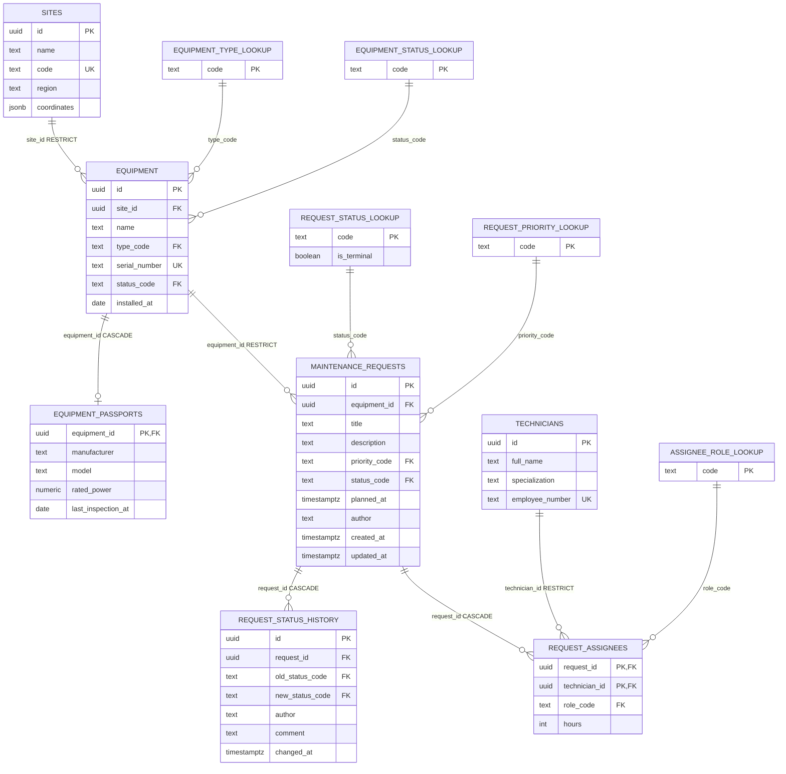

# Technical Service

REST API на Express для учёта оборудования производственной площадки (ветропарка) и заявок на его техническое обслуживание. Сервис ведёт справочник оборудования, контролирует жизненный цикл заявки через машину переходов статусов и позволяет оценить погодные условия на объекте перед планированием наружных работ.

Данные хранятся в PostgreSQL; доступ изолирован за слоем репозитория — контроллеры и сервисы не зависят от способа хранения.

## Содержание

- [Требования к окружению](#требования-к-окружению)
- [Установка и запуск](#установка-и-запуск)
- [Переменные окружения](#переменные-окружения)
- [Аутентификация и роли](#аутентификация-и-роли)
- [Состав API](#состав-api)
- [Модель данных](#модель-данных)
- [Формат ответа об ошибке](#формат-ответа-об-ошибке)
- [Коды ответов](#коды-ответов)
- [Примеры запросов](#примеры-запросов)
- [Безопасность](#безопасность)
- [Логирование](#логирование)
- [Погода](#погода)
- [Массовый импорт заявок](#массовый-импорт-заявок)
- [Тестирование](#тестирование)
- [Структура проекта](#структура-проекта)
- [Git](#git)
- **[Кейс 3: перенос на PostgreSQL](#кейс-3-перенос-на-postgresql)**
  - [Схема данных и связи](#схема-данных-и-связи)
  - [ER-диаграмма](#er-диаграмма)
  - [Миграции и роль приложения](#миграции-и-роль-приложения)
  - [Сиды и перенос данных из Кейса 2](#сиды-и-перенос-данных-из-кейса-2)
  - [Модели и ассоциации](#модели-и-ассоциации)
  - [Транзакции](#транзакции)
  - [Новые эндпоинты](#новые-эндпоинты)
  - [SQL-отчёты](#sql-отчёты)
  - [Защита от SQL-инъекций](#защита-от-sql-инъекций)
  - [Переменные окружения БД](#переменные-окружения-бд)
  - [Запуск и откат миграций](#запуск-и-откат-миграций)
- **[Кейс 4: аутентификация, деплой, мониторинг](#кейс-4-аутентификация-деплой-мониторинг)**
  - [Деплой: Docker Compose и Nginx](#деплой-docker-compose-и-nginx)
  - [Мониторинг: Prometheus, Grafana, Loki](#мониторинг-prometheus-grafana-loki)
  - [Эксплуатационная инструкция](#эксплуатационная-инструкция)
  - [Архитектурные решения и известные ограничения](#архитектурные-решения-и-известные-ограничения)

## Требования к окружению

- Node.js 20.6+ (используется нативный флаг `--env-file`, без `dotenv`)
- pnpm

## Установка и запуск

```bash
pnpm install
cp .env.example .env
pnpm dev
```

`pnpm dev` — с автоперезапуском при изменении файлов. `pnpm start` — без него.

### Через Docker (полный стек: Nginx + приложение + PostgreSQL + мониторинг)

```bash
cp .env.example .env

# самоподписанный сертификат nginx и basic-auth для /grafana/ — оба на
# чистом openssl, без дополнительных пакетов (htpasswd из apache2-utils
# на чистой машине обычно не стоит)
mkdir -p nginx/ssl nginx/auth
openssl req -x509 -newkey rsa:2048 -nodes -days 365 \
  -keyout nginx/ssl/key.pem -out nginx/ssl/cert.pem -subj "/CN=localhost"
echo "admin:$(openssl passwd -apr1 'ChangeMe123!')" > nginx/auth/htpasswd

docker compose up -d --build
```

Поднимается одной командой весь стек: `nginx` (обратный прокси, :80/:443) → `app` → `db` (PostgreSQL) + `migrate`/`seed` (одноразовые сервисы: миграции, затем демо-данные, оба до старта `app`) + `prometheus`/`grafana`/`loki`/`promtail`/`node-exporter`. Порядок запуска обеспечен `depends_on`/`healthcheck`: `app` не стартует раньше, чем `db` станет healthy и `seed` завершится успешно (а он сам ждёт `migrate`); `nginx` — раньше, чем `app` станет healthy. `seed` безопасно гонять повторно (например, при рестарте стека) — уже применённые сидеры не дублируются (`seederStorage: 'sequelize'` в `config/config.js`, проверено вручную тройным подряд `docker compose up`). Снаружи опубликованы только `80`/`443` (nginx) — `db` слушает исключительно `127.0.0.1:5432`, `app`/`grafana`/`prometheus`/`loki` вообще не публикуются напрямую. Данные `db` и настройки `grafana` живут в именованных томах (`postgres-data`, `grafana-storage`, `loki-data`) — `docker compose down` (без `-v`) их не трогает.

Контейнер приложения всегда стартует с `NODE_ENV=production` (задано в `docker-compose.yml`, поверх значения из `.env`) — отключает цветной dev-лог и скрывает внутренние детали ошибок в ответах API. Образ (`Dockerfile`) собирается в две стадии: зависимости ставятся отдельным кэшируемым слоем, в финальном образе нет `pnpm`/dev-зависимостей, процесс работает от непривилегированного пользователя `node`, а не от root.

Подробности — в разделе [Кейс 4: аутентификация, деплой, мониторинг](#кейс-4-аутентификация-деплой-мониторинг).

### Прочие команды

| Команда | Назначение |
|---|---|
| `pnpm test` | прогнать тесты (Vitest + Supertest) |
| `pnpm test:watch` | тесты в watch-режиме |
| `pnpm test:coverage` | тесты с отчётом о покрытии (`coverage/index.html`) |
| `pnpm typecheck` | проверка типов (`tsc --noEmit`) |
| `pnpm lint` / `pnpm format` | проверка / автофикс стиля (Biome) |

Перед каждым коммитом `lefthook` автоматически прогоняет `typecheck` и `test`.

## Переменные окружения

| Переменная | Назначение | Значение по умолчанию (в коде) |
|---|---|---|
| `PORT` | порт сервера | `3000` |
| `NODE_ENV` | окружение (`development`/`test`/`production`) | `development` |
| `CORS_ORIGINS` | список разрешённых источников через запятую | `` (пусто — см. раздел "Безопасность") |
| `RATE_LIMIT_WINDOW_MS` | окно общего rate-limit на `/api` в мс | `60000` |
| `RATE_LIMIT_MAX` | максимум запросов на `/api` за окно | `100` |
| `WEATHER_API_URL` | базовый URL погодного API (Open-Meteo) | `https://api.open-meteo.com/v1` |
| `REQUEST_TIMEOUT_MS` | таймаут запроса к внешнему API | `5000` |
| `JWT_ACCESS_SECRET` | секрет подписи access-токена | — (обязательна) |
| `JWT_REFRESH_SECRET` | секрет подписи refresh-токена (отдельный от access) | — (обязательна) |
| `AUTH_RATE_LIMIT_WINDOW_MS` | окно отдельного rate-limit на `/auth/login` и `/auth/register` в мс | `900000` (15 мин) |
| `AUTH_RATE_LIMIT_MAX` | максимум попыток на `/auth/login` или `/auth/register` за окно (у каждого свой счётчик) | `5` |

Переменные БД (`POSTGRES_*`, `APP_DB_USER`/`APP_DB_PASSWORD`) описаны в разделе Кейса 3 — [Переменные окружения БД](#переменные-окружения-бд). Переменные для read-only роли Grafana (`GRAFANA_DB_USER`/`GRAFANA_DB_PASSWORD`) и опциональный `GRAFANA_ADMIN_PASSWORD` (пароль веб-интерфейса Grafana, по умолчанию `admin`) — в разделе [Мониторинг](#мониторинг-prometheus-grafana-loki).

Все переменные валидируются при старте через Zod-схему (`src/config/env.ts`) — при некорректном значении сервер не запустится, а не упадёт где-то посередине выполнения. Секретов в репозитории нет — все значения только в `.env` (в `.gitignore`), `.env.example` содержит лишь безопасные dev-дефолты.

## Аутентификация и роли

Доступ к API закрыт JWT-аутентификацией: access-токен передаётся в заголовке `Authorization: Bearer <token>`, живёт 15 минут; refresh-токен выдаётся в `HttpOnly`-cookie на 7 дней.

| Метод | Путь | Назначение |
|---|---|---|
| POST | `/api/auth/register` | регистрация (роль всегда `viewer`, тело запроса не может её переопределить) |
| POST | `/api/auth/login` | вход — access-токен в теле ответа, refresh — в cookie |
| POST | `/api/auth/refresh` | обновление access-токена по refresh-cookie |
| POST | `/api/auth/logout` | завершение сессии (отзывает refresh-токен) |
| GET | `/api/auth/me` | текущий пользователь и его роль |

### Таблица доступа

| Роль | Права |
|---|---|
| `viewer` | чтение справочников, оборудования, заявок, истории и отчётов |
| `technician` | права `viewer` + создание/редактирование заявок (`POST`/`PATCH /api/requests`), смена статуса **только тех заявок, на которые сам назначен** |
| `admin` | все операции, включая управление оборудованием, площадками, специалистами, назначение бригад на любые заявки и удаление записей |

Любой запрос без токена — `401`; с валидным токеном, но недостаточной ролью — `403`. Все `GET`-маршруты доступны любому аутентифицированному пользователю независимо от роли.

### Токены и сессия

- Пароли хранятся только как bcrypt-хеш (`cost = 10`); ни пароль, ни хеш никогда не попадают в ответы API или в логи (тело запроса не логируется вовсе).
- Access- и refresh-токены подписаны разными секретами из переменных окружения (`JWT_ACCESS_SECRET`/`JWT_REFRESH_SECRET`).
- Refresh-cookie — `HttpOnly` (недоступна JS на странице — защита от XSS), `Secure` в продакшене, `SameSite=Strict`. `Strict` выбран осознанно: фронтенд и API обслуживаются с одного origin через nginx, легитимных кросс-сайтовых запросов с этой cookie не бывает — значит `Strict` закрывает CSRF полностью, не ломая ни один реальный сценарий.
- Отзыв сессии (`logout`) — через счётчик `users.token_version`, а не Redis-блэклист: `logout` инкрементит счётчик, `refresh` сверяет его со значением в токене. **Компромисс**: уже выданный access-токен (до 15 минут) формально доживает свой срок — отзыв останавливает только выдачу *новых* access-токенов через `refresh`, не отзывает немедленно то, что уже на руках. Полная ротация refresh-токена (выпуск нового при каждом использовании) не реализована — это осознанно упрощённая версия паттерна, см. [известные ограничения](#архитектурные-решения-и-известные-ограничения).
- `POST /api/auth/login` и `POST /api/auth/register` защищены отдельным rate-limit'ом (у каждого свой счётчик, см. `AUTH_RATE_LIMIT_*`). Ответ на несуществующий email и на неверный пароль — **одинаковый**, чтобы по нему нельзя было узнать, зарегистрирован ли аккаунт.
- Демо-пользователи (из сидов, пароль у всех `Demo12345!`): `admin@tech-service.local` (роль `admin`), `technician@tech-service.local` (роль `technician`, привязан к одному из сидовых специалистов), `viewer@tech-service.local` (роль `viewer`).

## Состав API

Эндпоинты `/api/auth/*` — отдельной таблицей в разделе [Аутентификация и роли](#аутентификация-и-роли) выше. Все остальные маршруты ниже требуют валидный `Authorization: Bearer` (401 без него), часть — ещё и конкретную роль (403 при недостаточных правах, см. таблицу доступа там же).

| Метод | Путь | Назначение |
|---|---|---|
| GET | `/api/health/live` | жизнеспособность процесса (без аутентификации) |
| GET | `/api/health/ready` | готовность к обслуживанию, проверяет БД (без аутентификации) |
| GET | `/api/docs` | интерактивная документация OpenAPI, Swagger UI (без аутентификации) |
| GET | `/metrics` | метрики для Prometheus (без аутентификации, но закрыт на уровне nginx — см. [Деплой](#деплой-docker-compose-и-nginx)) |
| GET | `/api/equipment` | список оборудования: фильтры (`status`, `type`), сортировка, пагинация |
| POST | `/api/equipment` | создание единицы оборудования |
| GET | `/api/equipment/:id` | карточка оборудования |
| PATCH | `/api/equipment/:id` | частичное обновление |
| DELETE | `/api/equipment/:id` | удаление (запрещено при наличии незакрытых заявок — 409) |
| GET | `/api/equipment/:id/requests` | заявки по конкретной единице оборудования |
| GET | `/api/equipment/:id/weather` | прогноз погоды по координатам объекта + признак пригодности окна для наружных работ |
| GET | `/api/requests` | список заявок: фильтры (`status`, `priority`, `equipmentId`, `dateFrom`/`dateTo`), сортировка, пагинация |
| POST | `/api/requests` | создание заявки |
| POST | `/api/requests/bulk` | массовый импорт заявок с частичным успехом (`207`, отчёт по каждой записи) |
| GET | `/api/requests/:id` | карточка заявки |
| PATCH | `/api/requests/:id` | редактирование полей заявки (`title`, `description`, `priority`, `plannedAt`) |
| PATCH | `/api/requests/:id/status` | смена статуса заявки с проверкой допустимости перехода |
| DELETE | `/api/requests/:id` | удаление заявки |

Список/пагинация — общий контракт для `equipment` и `requests`: ответ содержит `{ data, total, page, limit }`.

Спецификация OpenAPI (`src/docs/openapi.ts`) собирается из тех же Zod-схем, что валидируют запросы (`src/validators/*.ts`), поэтому не расходится с реальной валидацией сама по себе. Формы тел ответов и единый формат ошибки описаны отдельно в `src/docs/schemas.ts` — только для документации, эти схемы нигде не используются для валидации.

## Модель данных

### Оборудование (`equipment`)

| Поле | Тип | Примечание |
|---|---|---|
| `id` | `string` | uuid, генерируется сервером |
| `name` | `string` | 3–100 символов, обязательное |
| `type` | `turbine \| inverter \| sensor \| substation` | |
| `serialNumber` | `string` | уникален в пределах системы |
| `location` | `{ lat: number, lon: number }` | |
| `status` | `operational \| maintenance \| fault \| decommissioned` | |
| `installedAt` | `string` (ISO-дата) | не в будущем |

### Заявка на обслуживание (`request`)

| Поле | Тип | Примечание |
|---|---|---|
| `id` | `string` | uuid, генерируется сервером |
| `equipmentId` | `string` | ссылка на существующее оборудование |
| `title` | `string` | 5–120 символов, обязательное |
| `description` | `string?` | до 2000 символов, необязательное |
| `priority` | `low \| medium \| high \| critical` | |
| `status` | `new \| in_progress \| done \| rejected` | по умолчанию `new` |
| `plannedAt` | `string?` (ISO-дата-время) | необязательное |
| `createdAt` / `updatedAt` | `string` (ISO-дата-время) | проставляются сервером |

Поля `id`, `createdAt`, `updatedAt` (и `status` при создании) недоступны для изменения через API — клиент не может их переопределить. Неизвестные поля тела запроса тихо отбрасываются (используется `z.object`, а не `z.strictObject` — задание прямо требует именно игнорировать неизвестные поля, а не отклонять запрос ошибкой).

### Переходы статуса заявки

```
new ──────▶ in_progress ──────▶ done
 │                │
 └──────▶ rejected ◀─────┘
```

Допустимо: `new → in_progress`, `new → rejected`, `in_progress → done`, `in_progress → rejected`. Из `done` и `rejected` переходов нет. Смена статуса — только через `PATCH /api/requests/:id/status`; обычный `PATCH /api/requests/:id` статус не принимает. Недопустимый переход → `409`.

## Формат ответа об ошибке

Все ошибки API возвращаются в едином формате — [RFC 9457, Problem Details for HTTP APIs](https://www.rfc-editor.org/rfc/rfc9457.html):

```json
{
  "type": "https://example.com/problems/not_found",
  "title": "Заявка не найдена",
  "status": 404,
  "instance": "/api/requests/unknown-id",
  "requestId": "b1f2c3d4-...",
  "errors": [{ "field": "priority", "code": "invalid_enum_value", "message": "..." }]
}
```

`errors` присутствует только у ошибок валидации и содержит конкретное поле/причину. `requestId` есть всегда — по нему можно найти запись в логах.

**Почему RFC 9457, а не формат, буквально показанный в задании как пример.** Формулировка задания — "единый формат, **например**": то есть требование в том, чтобы формат был **единый по всему API**, а не в конкретном наборе ключей. RFC 9457 — признанный IETF-стандарт с готовой семантикой (`type` — machine-readable идентификатор проблемы, `instance` — конкретный URI, `status` — дублирует HTTP-код для удобства клиента), а не самодельная структура. Выбран сознательно вместо примера из задания.

## Коды ответов

`200`, `201` (с заголовком `Location`), `204`, `207` (массовый импорт заявок — частичный успех), `400` (синтаксически некорректное тело запроса (битый JSON), а также любая ошибка валидации **query-параметров** — недопустимое значение `limit`/`page`/`sort`/фильтров), `401` (отсутствующий/невалидный/просроченный `Authorization: Bearer`, а также неверные учётные данные при логине), `403` (CORS, либо роль недостаточна для операции — `authorize()`/ABAC по заявкам технику), `404`, `409` (конфликт: дубль `serialNumber`, дубль email при регистрации, недопустимый переход статуса, удаление оборудования с открытыми заявками), `422` (ошибка валидации **тела запроса или params** — бизнес-правила, Zod-схемы для `body`, невалидный uuid в пути), `429` (общий rate limit на `/api`, либо отдельный — на `/auth/login`/`/auth/register`), `503` (внешний погодный API недоступен).

`query` разведён с `body`/`params` по разным кодам сознательно: `middlewares/validate.ts` возвращает `BadRequestError` (400) для `query` и `ValidationError` (422) для `body`/`params` — это отдельно требуется для `limit`/`offset` в Кейсе 3 («значения вне диапазона отклоняются с кодом 400») и распространено на остальные query-фильтры для единообразия внутри одного эндпоинта.

## Примеры запросов

### Вход

```
POST /api/auth/login
Content-Type: application/json

{ "email": "admin@tech-service.local", "password": "Demo12345!" }
```
→ `200`, тело `{ "accessToken": "...", "user": { "id": "...", "email": "...", "role": "admin" } }`, в `Set-Cookie` — refresh-токен (`HttpOnly`/`Secure`/`SameSite=Strict`). `accessToken` дальше передаётся в `Authorization: Bearer <accessToken>`.

### Создание оборудования — успех

```
POST /api/equipment
Content-Type: application/json
Authorization: Bearer <accessToken>

{
  "name": "Турбина №1",
  "type": "turbine",
  "serialNumber": "WT-0001",
  "status": "operational",
  "installedAt": "2024-01-01"
}
```
→ `201 Created`, заголовок `Location: /api/equipment/{id}`, тело — созданный объект с `id`. `siteId` необязателен (если не передан — привязывается к служебной площадке-заглушке); эндпоинт доступен только роли `admin`.

### Создание оборудования — ошибка валидации

```
POST /api/equipment
{ "name": "АБ", ... }
```
→ `422`:
```json
{
  "type": "https://example.com/problems/validation_failed",
  "title": "Ошибка валидации",
  "status": 422,
  "errors": [{ "field": "name", "code": "too_small", "message": "Too small: expected string to have >=3 characters" }]
}
```

### Недопустимый переход статуса

```
PATCH /api/requests/{id}/status
{ "status": "new" }
```
(если заявка уже в `in_progress`) → `409`:
```json
{ "title": "Недопустимый переход статуса: in_progress → new", "status": 409 }
```

Полный набор сценариев (включая 404/409/429 и happy path каждого эндпоинта) — в Postman-коллекции, `docs/postman/`.

## Безопасность

- **CORS** — явный allow-list источников из `CORS_ORIGINS` (через запятую), не `*`. Запрос без заголовка `Origin` (curl, Postman, server-to-server) пропускается всегда; запрос с `Origin`, которого нет в списке — `403`. По умолчанию `CORS_ORIGINS` пуст — это осознанное решение "deny by default": список разрешённых источников специфичен для конкретного окружения (dev/stage/prod), и в задании нет универсального дефолта, который был бы правильным для всех случаев. Перед реальным использованием из браузера переменную нужно явно задать.
- **Rate limiting** — `express-rate-limit` на все `/api`-маршруты, `RATE_LIMIT_MAX` запросов за `RATE_LIMIT_WINDOW_MS`. При превышении — `429` с заголовками `RateLimit-Limit`/`RateLimit-Remaining`/`RateLimit-Reset`.
- **helmet** — стандартный набор защитных заголовков (CSP, `X-Content-Type-Options`, `X-Frame-Options` и т.д.).
- **Размер тела запроса** — ограничен 100kb (`express.json({ limit: '100kb' })`).
- **Аутентификация и роли** — JWT (access + refresh), три роли (`viewer`/`technician`/`admin`), подробности и таблица доступа — в разделе [Аутентификация и роли](#аутентификация-и-роли). `X-API-Key` из предыдущих кейсов полностью убран, не используется параллельно с JWT.
- **Cookies** — только одна, `refreshToken`: `HttpOnly` (недоступна JS — защита от XSS), `Secure` в продакшене, `SameSite=Strict` (обоснование выбора — там же).
- **Продакшн-режим** — в ответах об ошибках не попадают стек-трейсы и внутренние сообщения (для 5xx клиент видит нейтральный текст, детали — только в логах).

## Логирование

Структурированные логи через `pino`. Каждый запрос логируется с методом, путём, кодом ответа и длительностью (`pino-http`). Каждому запросу присваивается `requestId` (переиспользуется из заголовка `X-Request-Id`, если он уже был проставлен апстримом), возвращается клиенту в заголовке ответа и в теле ошибки — по нему запрос находится в логах. Внутри сервисов/репозиториев `requestId`/логгер доступны через `AsyncLocalStorage`, без передачи `req` явным параметром через слои. `console.log` в финальном коде не используется.

Логи пишутся только в `stdout` — файлового транспорта нет (это осознанно: контейнеризованный процесс не должен сам заниматься ротацией/хранением файлов логов — это задача платформы). Локально видно прямо в терминале; в Docker — `docker compose logs -f app`.

## Погода

`GET /api/equipment/:id/weather` берёт координаты оборудования, запрашивает прогноз на 3 дня у Open-Meteo и добавляет к каждому дню признак `suitableForOutdoorWork`. Правило пригодности задаётся в конфигурации (`src/config/weather.ts`): отсутствие осадков и скорость ветра ниже 20 км/ч (дневной максимум). Недоступность внешнего API не роняет сервис — возвращается `503` с понятным сообщением, остальные эндпоинты продолжают работать.

## Массовый импорт заявок

`POST /api/requests/bulk` принимает массив заявок (от 1 до 100 элементов, тот же формат, что и одиночное создание) и обрабатывает каждую независимо — ошибка в одном элементе не отменяет остальные:

```
POST /api/requests/bulk
Content-Type: application/json
Authorization: Bearer <accessToken>

{
  "requests": [
    { "equipmentId": "...", "title": "Проверить крепление лопасти", "priority": "high", "author": "Оператор" },
    { "equipmentId": "...", "title": "АБ", "priority": "low", "author": "Оператор" }
  ]
}
```
Доступно ролям `technician`/`admin`.

Ответ — всегда `207 Multi-Status`, независимо от того, все ли записи прошли успешно:

```json
{
  "results": [
    { "index": 0, "status": "created", "data": { "id": "...", "...": "..." } },
    { "index": 1, "status": "error", "errors": [{ "field": "title", "code": "too_small", "message": "..." }] }
  ],
  "summary": { "total": 2, "created": 1, "failed": 1 }
}
```

Каждый элемент валидируется той же Zod-схемой, что и `POST /api/requests` (включая проверку существования `equipmentId`), но по отдельности — поэтому в отчёте видно, какая именно запись и почему не прошла.

## Тестирование

Автотесты — Vitest + Supertest (113 тестов в 8 файлах): happy path и негативные сценарии для всех эндпоинтов, включая аутентификацию (`auth.route.test.ts` — register/login/refresh/logout/me, одинаковое сообщение на неверный пароль и несуществующий email, rate-limit), роли (`401`/`403` на каждую связку маршрут+роль) и ABAC (technician не из бригады получает `403` на смену статуса чужой заявки). Vitest выбран вместо Jest как прямой современный аналог с идентичным API (`describe`/`it`/`expect`) — нативная поддержка ESM/TypeScript без экспериментальных флагов, что соответствует остальному стеку проекта (pnpm, `tsx`, Biome). Тесты используют отдельную тестовую БД (`tech-service-test`) с полной очисткой данных между тестами (`resetDb()`), внешние вызовы (погодное API) подменяются заглушками — повторный прогон детерминирован.

`pnpm test:coverage` — отчёт о покрытии (`@vitest/coverage-v8`, text/html/lcov), текущий результат — 90% строк.

Postman-коллекция — `docs/postman/Technical-Service.postman_collection.json`, сгруппирована по ресурсам (Auth/Health/Equipment/Requests/Security/Sites/Reports), с `pm.test` на каждый запрос и переменными, передающими id между запросами. Папка `Auth` — первая в коллекции: логинится под демо-админом и выставляет `{{accessToken}}` для всех остальных папок; первым делом также демонстрирует сценарии register/login/refresh/logout и общий rate-limit. В описании коллекции (`info.description`) — два известных не связанных с авторизацией ограничения: `technicianId` нужно вписать вручную (создать специалиста через API нельзя, только сидом), `GET /equipment/:id/weather` требует площадку с заданными координатами. Отдельный сценарий в папке Security намеренно вызывает `429` на общем rate-limit, поэтому стоит ближе к концу коллекции.

## Структура проекта

```
src/
├── app.ts, server.ts    # сборка приложения отделена от запуска (graceful shutdown — в server.ts)
├── routes/              # маршруты: authenticate → authorize(...) → validate(...) → контроллер
├── controllers/         # тонкий HTTP-слой: разбор запроса → вызов сервиса → ответ
├── services/            # бизнес-логика, включая ABAC-проверки
├── repositories/        # доступ к данным через Sequelize, изолирован интерфейсом
├── validators/          # Zod-схемы запросов
├── middlewares/         # аутентификация, роли, rate-limit, логирование, контекст, CORS, обработчик ошибок
├── errors/              # собственные классы ошибок, не привязанные к Express
├── clients/             # клиент внешнего погодного API
├── docs/                # сборка OpenAPI-спецификации из тех же Zod-схем
├── config/              # переменные окружения (Zod), логи, метрики, JWT, погода
└── testUtils/           # общие фикстуры для тестов (создание сущностей, сброс БД)
models/                  # sequelize-typescript модели и ассоциации
migrations/, seeders/    # схема БД и демо-данные (sequelize-cli)
nginx/                   # конфигурация обратного прокси
grafana/                 # дашборд и provisioning (датасорсы, алерты)
docs/postman/            # экспортированная Postman-коллекция
```

## Git

Работа по Кейсам 2–3 велась в отдельных ветках по функциональным блокам, каждая — отдельный PR: `feat/errors-and-logging`, `feat/equipment-crud`, `feat/requests-crud`, `feat/security-and-weather`, `docs/postman-collection`, `fix/validation-and-pagination`, и далее по Кейсу 3 — `feat/sequelize-connection`, `feat/postgres-crud-migration`, `feat/team-reports-and-sites` и т.д. (полная история — `git log`). Кейс 4 продолжил тот же принцип: `feat/auth-and-roles`, `feat/nginx-monitoring-stack`, `feat/metrics-and-grafana`, `feat/openapi-docs`, `chore/test-coverage-and-postman-auth`, `chore/dockerfile-and-openapi-auth`. Прямых коммитов в `master` нет, каждая ветка — отдельный PR.

---

## Кейс 3: перенос на PostgreSQL

Файловое хранилище (`storage/`) заменено на PostgreSQL. Внешний контракт API из Кейса 2 сохранён без изменений — те же пути, коды ответов и имена полей (`type`, `status`, `priority`); прежняя Postman-коллекция проходит без правок. Предметная модель расширена: площадки, технические паспорта оборудования, специалисты и назначения на заявки, журнал изменений статусов.

### Схема данных и связи

| Сущность | Назначение |
|---|---|
| `sites` | площадка: название, код, регион, координаты |
| `equipment` | оборудование: площадка, наименование, тип, серийный номер, статус, дата установки |
| `equipment_passports` | паспорт оборудования (1:1 с `equipment`): производитель, модель, номинальная мощность, дата поверки |
| `maintenance_requests` | заявка на обслуживание |
| `request_status_history` | журнал изменений статуса заявки (1:N, записи не редактируются и не удаляются) |
| `technicians` | специалист: ФИО, специализация, табельный номер |
| `request_assignees` | назначение специалиста на заявку (N:M, композитный PK `request_id`+`technician_id`), роль (`lead`/`member`), плановые трудозатраты |
| `equipment_status_lookup`, `equipment_type_lookup`, `request_status_lookup`, `request_priority_lookup`, `assignee_role_lookup` | справочники допустимых значений (natural key `code`, а не суррогатный id) — схема приведена к 3НФ, перечисления не зашиты в тип колонки |

`request_status_lookup` дополнительно хранит `is_terminal` — по нему определяется, какие статусы заявки считаются закрытыми (используется и в бизнес-правилах, и в отчёте по площадке), без хардкода конкретных значений статусов в коде.

**Правила `ON DELETE`** выбраны осознанно, а не по умолчанию:
- `RESTRICT` — `sites → equipment`, `equipment → maintenance_requests`, `request_assignees → technicians`: оборудование и площадки не удаляются физически, пока с ними связана история (для вывода оборудования из эксплуатации есть `status = decommissioned`); специалиста нельзя удалить, если он назначен на заявку.
- `CASCADE` — `equipment → equipment_passports`, `maintenance_requests → request_status_history`, `maintenance_requests → request_assignees`: эти записи не имеют смысла без родителя (паспорт — часть карточки оборудования, история/назначения — часть конкретной заявки, которую по контракту Кейса 2 можно удалить эндпоинтом `DELETE /api/requests/:id`).

### ER-диаграмма



### Миграции и роль приложения

13 миграций (`sequelize-cli`, `migrations/`): пять справочников → `sites`/`technicians` → `equipment` → `equipment_passports`/`maintenance_requests` → `request_status_history`/`request_assignees` → служебная миграция `create-app-role-and-grants`. Порядок обеспечивает, что зависимые таблицы создаются после тех, на кого они ссылаются. Схема создаётся исключительно миграциями, `sync({ force: true })` не используется. Каждая миграция обратима; полный цикл `apply all → rollback all → apply again` проверен вручную на живой базе.

Приложение подключается к БД под отдельной, непривилегированной ролью (`APP_DB_USER`), а не под ролью-владельцем схемы (`POSTGRES_USER`, используется только миграциями). Последняя миграция создаёт роль и настраивает права транзакционно: широкий `GRANT SELECT/INSERT/UPDATE/DELETE` на все таблицы, а затем точечные `REVOKE`:
- только чтение на справочники (`equipment_status_lookup` и т.д.) — приложение не пишет в них напрямую;
- только `INSERT` на `request_status_history` (без `UPDATE`/`DELETE`) — журнал статусов физически неизменяем на уровне БД, а не только по соглашению в коде;
- никаких прав на служебную таблицу `SequelizeMeta`.

Проверено вручную: попытка `UPDATE`/`DELETE` на `request_status_history` под рабочей ролью приложения отклоняется с ошибкой доступа Postgres.

### Сиды и перенос данных из Кейса 2

Сиды (`seeders/`) наполняют базу данными, достаточными для демонстрации всех связей и обоих отчётов: 3 площадки, 8 единиц оборудования, 24 заявки во всех статусах (включая отклонённые и незакрытые без бригады), 6 специалистов, назначения и полная история статусов. Даты в сидах детерминированные (смещения от фиксированной базовой даты, а не `Date.now()`) — повторный прогон даёт тот же результат.

`scripts/migrate-legacy-data.ts` переносит данные из файлового хранилища Кейса 2 (`storage/equipment.json`, `storage/requests.json`) в PostgreSQL одной транзакцией, с перелинковкой `equipmentId` на новые UUID; оборудование без площадки в старых данных попадает на служебную площадку-заглушку. Если файлов нет — скрипт корректно завершается без ошибки.

### Модели и ассоциации

Модели — декораторные классы `sequelize-typescript` (`models/*.model.ts`), поля и ограничения соответствуют миграциям без расхождений. Ассоциации описаны в обе стороны: `belongsTo` на стороне внешнего ключа, `hasOne`/`hasMany`/`belongsToMany` (с `through`) — на родительской, что и используется в `include` списочных эндпоинтов без проблемы N+1 (`findAndCountAll` + `distinct: true`). Выборки ограничивают поля через `attributes`.

### Транзакции

- **Смена статуса заявки** (`PATCH /api/requests/:id/status`) — одна транзакция: блокировка строки заявки (`LOCK.UPDATE`, защита от конкурентного изменения), проверка допустимости перехода, для `in_progress` — проверка наличия хотя бы одного назначенного специалиста (иначе `409`), обновление заявки и запись в `request_status_history`.
- **Назначение бригады** (`POST /api/requests/:id/assignees`) — одна транзакция: блокировка строки заявки, проверка существования всех специалистов (`404`), проверка "ровно один `lead`" (`422`, ещё до транзакции — по составу входного массива), снятие прежних назначений и вставка новых; повторное назначение того же специалиста — `409` (уникальность пары обеспечена композитным PK).

### Новые эндпоинты

| Метод | Путь | Назначение |
|---|---|---|
| POST | `/api/requests/:id/assignees` | назначение бригады на заявку |
| DELETE | `/api/requests/:id/assignees/:userId` | снятие специалиста с заявки |
| GET | `/api/requests/:id/history` | история изменений статуса заявки |
| GET | `/api/sites/:id/summary` | сводка по площадке: заявки по статусам/приоритетам, среднее время закрытия |
| GET | `/api/reports/equipment-load` | нагрузка на оборудование (raw SQL), с фильтрами `dateFrom`/`dateTo`/`minRequests` |

Карточка оборудования дополнительно отдаёт паспорт, карточка заявки — назначенных специалистов с ролями.

Postman-коллекция (`docs/postman/Technical-Service.postman_collection.json`) дополнена под все пять эндпоинтов выше: новые папки Sites/Reports, плюс негативные сценарии в Requests — назначение несуществующего специалиста (`404`), бригада без ведущего специалиста (`422`), перевод в `in_progress` без бригады (`409`), снятие несуществующего назначения (`404`). Прежние запросы Кейса 2 не менялись.

Сценарий «повторное назначение того же специалиста — `409`» в коллекцию не добавлен: `POST .../assignees` в текущей реализации полностью заменяет список бригады (`destroy` + `bulkCreate` одной транзакцией), а дубль `technicianId` внутри одного запроса отсекается ещё на уровне Zod-валидатора (`422`, до обращения к БД). `UniqueConstraintError → 409` в сервисе формально есть, но при таком дизайне эндпоинта не находится сценария, где он реально достижим через HTTP.

### SQL-отчёты

`GET /api/reports/equipment-load` — прямой SQL-запрос с `JOIN` нескольких таблиц, `GROUP BY`/`HAVING`, агрегатами (`COUNT`, `COUNT ... FILTER`, `SUM`, `MAX`) — число заявок и закрытых заявок на единицу оборудования, суммарные плановые трудозатраты, дата последнего обслуживания.

`GET /api/sites/:id/summary` — количество заявок в разрезе статусов/приоритетов и среднее время от создания до закрытия заявки; средняя длительность считается в коде на плоской выборке пар "создание/закрытие", а не одним SQL с `AVG`, чтобы второй `include` (история статусов) не размножал строки основной агрегации по статусам/приоритетам.

### Защита от SQL-инъекций

Прямой SQL-запрос отчёта использует только `bind`-параметры (`$1`/`$2`/`$3`), конкатенация пользовательского ввода в текст запроса не используется. Поля сортировки списочных эндпоинтов проверяются по белому списку (`z.enum` в валидаторах) — произвольное значение из query в `ORDER BY` не подставляется. Значения `limit`/`page` вне допустимого диапазона отклоняются с `400`, а не заменяются молча дефолтом. Учётные данные БД — в переменных окружения; приложение подключается под ролью с минимумом прав (см. «Миграции и роль приложения»).

### Переменные окружения БД

| Переменная | Назначение |
|---|---|
| `POSTGRES_HOST` / `POSTGRES_PORT` | адрес PostgreSQL |
| `POSTGRES_DB` | имя базы |
| `POSTGRES_USER` / `POSTGRES_PASSWORD` | роль-владелец схемы, используется миграциями/сидами (`config/config.js`) |
| `APP_DB_USER` / `APP_DB_PASSWORD` | ограниченная роль рантайма приложения (создаётся миграцией `create-app-role-and-grants`) |

### Запуск и откат миграций

```bash
cp .env.example .env
docker compose up -d db      # том данных + healthcheck, ждём "healthy"
pnpm db:migrate               # применить все миграции
pnpm db:seed                  # наполнить демо-данными
pnpm db:migrate-legacy        # перенос данных из storage/*.json Кейса 2, если есть
pnpm dev
```

Откат: `pnpm db:seed:undo:all`, затем `pnpm db:migrate:undo:all` (откатывает все миграции в обратном порядке, включая удаление роли приложения); `pnpm db:migrate:undo` — откатить только последнюю. Повторный `pnpm db:migrate` после полного отката проходит без ошибок — цикл проверен вручную.

### Индексы и производительность

Миграция `20260927000001-add-performance-indexes` добавляет пять индексов под реальные сценарии выборок:

| Индекс | Таблица | Колонка | Сценарий |
|---|---|---|---|
| `idx_maintenance_requests_status_code` | `maintenance_requests` | `status_code` | `GET /requests?status=...` — фильтр по статусу |
| `idx_maintenance_requests_equipment_id` | `maintenance_requests` | `equipment_id` | `GET /equipment/:id/requests`, JOIN в отчёте и сводке площадки |
| `idx_maintenance_requests_created_at` | `maintenance_requests` | `created_at` | Сортировка по умолчанию (`ORDER BY created_at DESC`) и фильтры `dateFrom`/`dateTo` |
| `idx_request_status_history_request_id` | `request_status_history` | `request_id` | `GET /requests/:id/history` |
| `idx_request_assignees_technician_id` | `request_assignees` | `technician_id` | JOIN при проверке специалистов в транзакции назначения бригады |

**EXPLAIN ANALYZE до применения миграции** (`WHERE equipment_id = ?`):

```
Seq Scan on maintenance_requests  (cost=0.00..1.00 rows=1 width=216)
                                   (actual time=0.026..0.036 rows=4 loops=1)
  Filter: (equipment_id = '...'::uuid)
  Rows Removed by Filter: 20
Planning Time: 1.669 ms  Execution Time: 0.147 ms
```

**EXPLAIN ANALYZE после** (с `SET enable_seqscan = off` — демонстрация пути через индекс):

```
Index Scan using idx_maintenance_requests_equipment_id on maintenance_requests
              (cost=0.14..8.15 rows=1 width=216) (actual time=0.151..0.154 rows=4 loops=1)
  Index Cond: (equipment_id = '...'::uuid)
Planning Time: 2.728 ms  Execution Time: 0.242 ms
```

На тестовом датасете (24 строки) планировщик выбирает Seq Scan без `enable_seqscan = off` — это ожидаемо: при малом числе строк последовательное сканирование одной страницы дешевле, чем переход по индексу. Индекс начинает применяться автоматически при росте таблицы; `enable_seqscan = off` используется только для демонстрации пути исполнения.

### Нереализованные бонусы

**Мягкое удаление (paranoid)** — не реализовано осознанно. Правило «нельзя удалить оборудование с незакрытыми заявками» сейчас обеспечивается `FK RESTRICT` на уровне БД: это атомарная гарантия без какого-либо окна для гонки. При включении `paranoid: true` `destroy()` перестаёт быть физическим удалением, и FK-констрейнт для soft-deleted записей больше не срабатывает. Защиту пришлось бы переносить в код сервиса как явную проверку перед `destroy()` — классический TOCTOU без дополнительной транзакции с блокировкой. Переносить уже работающий обязательный критерий в app-level проверку ради бонуса в 0.5 балла нецелесообразно.

---

## Кейс 4: аутентификация, деплой, мониторинг

Сервис доведён до состояния, пригодного к эксплуатации: аутентификация и роли описаны выше ([Аутентификация и роли](#аутентификация-и-роли)), здесь — всё остальное: как сервис разворачивается, как за ним наблюдать и что делать при типовых отказах.

### Деплой: Docker Compose и Nginx

```
                 ┌──────────────┐
 клиент ───────► │    nginx     │  :80 (→308 на :443) и :443 (TLS)
                 └──────┬───────┘
                        │ proxy_pass
                 ┌──────▼───────┐        ┌──────────────┐
                 │  api (node)  ├───────►│  postgres    │
                 └──────┬───────┘        └──────────────┘
                        │ /metrics
          ┌─────────────┴─────────────┐
          │                           │
   ┌──────▼──────┐             ┌──────▼──────┐
   │ prometheus  │             │    loki     │◄── promtail (логи всех контейнеров)
   └──────┬──────┘             └──────┬──────┘
          └─────────────┬─────────────┘
                   ┌─────▼─────┐
                   │  grafana  │  (за nginx, /grafana/, Basic Auth)
                   └───────────┘
```

Все сервисы — в одном `docker-compose.yml`, поднимаются командой `docker compose up -d --build`:

| Сервис | Назначение |
|---|---|
| `nginx` | обратный прокси, единственная точка входа снаружи (`80`/`443`) |
| `app` | само приложение |
| `migrate` | одноразовый сервис — гонит `sequelize db:migrate` и завершается |
| `seed` | одноразовый сервис после `migrate` — наполняет демо-данными (`sequelize db:seed:all`); `app` стартует только после его успешного завершения |
| `db` | PostgreSQL, порт пробрасывается только на `127.0.0.1:5432` (не снаружи) |
| `prometheus`, `node-exporter` | сбор метрик приложения и хоста |
| `grafana` | дашборды, источники данных и алертинг — всё через provisioning |
| `loki`, `promtail` | сбор и хранение логов всех контейнеров |

Порядок запуска держится на `healthcheck`+`depends_on`, а не на случайной задержке: `app` ждёт `db: healthy` и `migrate: service_completed_successfully`; `nginx` ждёт `app: healthy`. Если `db` стартует медленнее приложения (например, на холодном томе) — `app` просто не запустится раньше срока, а не упадёт в цикл рестартов. Повторный `docker compose up` на уже существующих томах не теряет данные (`postgres-data`, `grafana-storage`, `loki-data` — именованные тома, переживают `down` без `-v`).

**Nginx** (`nginx/nginx.conf`):
- Перенаправление `80 → 443` через `308` (не `301`/`302` — тело `POST`-запроса не теряется при редиректе).
- Пробрасывает `Host`/`X-Real-IP`/`X-Forwarded-For`/`X-Forwarded-Proto`/`X-Request-ID` на `app`; приложение настроено на доверие прокси (`trust proxy`) — rate-limit и логи видят реальный IP клиента, а не адрес nginx.
- Таймауты проксирования, `client_max_body_size 200k` (согласовано с лимитом `express.json()` в приложении — nginx не должен пропускать то, что оно и так отклонит), `gzip` на JSON-ответах.
- `upstream` объявлен с `resolve`/`zone`/`resolver 127.0.0.11` — без этого nginx резолвит контейнер `app` в IP один раз при своём старте и после пересоздания контейнера (`docker compose up -d --build app`) продолжал бы стучаться на старый адрес, отвечая `502` до собственного перезапуска. Проверено вживую: пересоздан только `app` (новый IP), `nginx` без перезапуска продолжил проксировать корректно.
- **Кэширование** — на дорогих read-only отчётах (`/api/reports/*`, `/api/sites/*/summary`), 30 секунд (протухание по времени — осознанная стратегия инвалидации, не обойдённый вопрос). Не распространяется на `/api/equipment`/`/api/requests` — они меняются слишком часто, чтобы оправдать риск отдать устаревшие данные. Ключ кэша включает `Authorization` — без этого второй клиент с чужим или отсутствующим токеном получил бы закэшированный ответ **в обход проверки аутентификации** (она происходит в приложении, которое кэш-хит не доходит). Проверено вживую: первый запрос — `MISS`, повтор тем же токеном — `HIT`, запрос без токена/с чужим токеном даже после прогретого кэша — честный `401`, не закэшированные данные.
- Маршрутизация по `location`: `/api/` → приложение, `/metrics` → приложение, но только с приватных адресов (`allow 172.16.0.0/12; allow 127.0.0.1; deny all`), `/grafana/` → Grafana за Basic Auth (`nginx/auth/htpasswd`, не в репозитории), всё остальное — `404`.
- Неизвестный хост/левый SNI на `443` — молчаливый обрыв соединения (`ssl_reject_handshake on`), а не ответ сервера по умолчанию.
- TLS-сертификат и Basic Auth для Grafana — не в репозитории (`nginx/ssl/`, `nginx/auth/` в `.gitignore`), генерируются один раз перед первым запуском, команды — в разделе [Установка и запуск](#установка-и-запуск) выше. Оба — через `openssl`, намеренно без `htpasswd` (пакет `apache2-utils`), которого на чистой машине может не быть.

### Мониторинг: Prometheus, Grafana, Loki

Приложение отдаёт метрики на `/metrics` (`prom-client`): длительность каждого запроса (`http_request_duration_seconds`, разбивка по `method`/`route`/`status_code`) плюс стандартные метрики процесса Node (память, event loop, GC). Prometheus собирает их по расписанию из `prometheus.yml`; `node-exporter` добавляет метрики самого хоста.

Grafana поднимается уже настроенной — датасорсы (`grafana/provisioning/datasources/`, Prometheus + отдельный read-only Postgres для прикладных панелей) и дашборд (`grafana/dashboards/technical-service.json`) подключаются автоматически при старте контейнера, никакой ручной настройки после `docker compose up` не требуется.

Дашборд «Technical Service»:
- **Технические панели** — интенсивность запросов (req/s), время ответа p95, доля 4xx, доля 5xx, доступность сервиса.
- **Прикладные панели** (через read-only Postgres-датасорс, `GRAFANA_DB_USER`/`GRAFANA_DB_PASSWORD` — отдельная роль с доступом только на `SELECT`) — заявки по статусам, заявки по приоритетам, среднее время закрытия заявки, число просроченных плановых работ, нагрузка на оборудование.

Алертинг (`grafana/provisioning/alerting/rules.yml`) — два условия:
- **Service is down** — `up{job="app"} < 1` в течение минуты — приложение недоступно.
- **High 5xx error rate** — доля `5xx` среди всех ответов выше 5% за последние 5 минут.

При срабатывании — смотреть `docker compose ps` (не упал ли контейнер) и `docker compose logs app`/`docker compose logs nginx` на предмет конкретной ошибки.

**Сквозная трассировка запроса** — nginx генерирует (или пробрасывает уже существующий) `$request_id` на каждый запрос, кладёт его в заголовок ответа `X-Request-ID` и в свой access-лог (JSON); приложение переиспользует тот же id как свой `requestId` (видно в заголовке ответа и в теле любой ошибки). Оба лога уходят в Loki через promtail под одним и тем же id — по нему один и тот же запрос находится и в логе nginx, и в логе приложения одним запросом в Grafana Explore (`|= "<request-id>"`). Проверено вживую: реальный запрос, один id, три найденные записи (nginx + 2 строки лога приложения).

### Эксплуатационная инструкция

- **Логи** — `docker compose logs -f app` / `docker compose logs -f nginx`, либо через Grafana → Explore → датасорс Loki (структурированные JSON-логи, можно фильтровать по `container`, `level`, тексту, включая `requestId`). Уровень логов приложения — `LOG_LEVEL` (по умолчанию `info`).
- **Метрики** — дашборд Grafana (за `/grafana/` на nginx) или напрямую Prometheus (`/metrics` на приложении, доступен только из приватной сети).
- **БД недоступна** — `GET /api/health/ready` вернёт признак неготовности (не `200`), контейнер `app` не пройдёт `healthcheck`. Проверить `docker compose ps db` и `docker compose logs db`; само приложение при недоступной БД не падает, отвечает ошибкой на эндпоинты, которым реально нужна БД.
- **Рост доли 5xx** — сработает алерт «High 5xx error rate»; дальше — `docker compose logs app` с фильтром по `"level":50` (error) или Grafana Explore по тому же условию.
- **Переполнение диска** — в первую очередь растут логи контейнеров и том Postgres; `docker system df` / `docker compose logs --tail 0 -f` для диагностики, `docker image prune`/`docker volume ls` для очистки неиспользуемого. Логи приложения сознательно не пишутся в файл (только `stdout`) — ротацией занимается Docker/платформа, а не сам процесс.
- **Откат миграций** — см. [Запуск и откат миграций](#запуск-и-откат-миграций) (Кейс 3) — та же механика (`pnpm db:migrate:undo[:all]`) применима и к миграциям Кейса 4 (`create-user-role-lookup`, `create-users-table`).
- **Корректное завершение** — по `SIGINT`/`SIGTERM` сервер перестаёт принимать новые соединения (`server.close()`), сразу освобождает простаивающие keepalive-соединения (`closeIdleConnections()`, иначе они висели бы до своего таймаута), дорабатывает текущие запросы и закрывает пул соединений с БД, прежде чем процесс завершится (`src/server.ts`). Таймаут-страховка на 25 секунд — если `close()` зависнет, процесс выйдет с ошибкой сам, не дожидаясь `SIGKILL` от Docker (`stop_grace_period: 30s`).

### Архитектурные решения и известные ограничения

- **Отзыв сессии не мгновенный** — `tokenVersion` проверяется только на `/auth/refresh`, не на каждый запрос (иначе каждый вызов API тянет лишний поход в БД). Подробности и обоснование — в [Аутентификация и роли](#аутентификация-и-роли).
- **Нет ротации refresh-токена** — при каждом `/auth/refresh` выдаётся новый access-токен, но refresh-токен остаётся тем же до истечения своих 7 дней или явного `logout`. Полноценная ротация (новый refresh-токен на каждое использование + обнаружение повторного использования старого) не реализована — осознанное упрощение в пользу stateless-проверки без похода в БД на каждый `refresh`.
- **Роли захардкожены в коде** (`authorize('admin')` и т.д.), а не вынесены в динамическую систему прав — оправдано, пока ролей ровно три; для более сложной модели потребовалась бы отдельная таблица permissions.
- **Postman-коллекция** — два известных ограничения не чинились в рамках этого кейса, задокументированы в `info.description` самой коллекции: переменная `technicianId` требует ручной подстановки (создать специалиста через API нельзя — только сидом), `GET /equipment/:id/weather` работает только для оборудования на площадке с заданными координатами.
- **TLS-сертификат самоподписанный** — подходит для учебного/локального стенда; в реальном продакшене — Let's Encrypt или сертификат от внешнего CA вместо `openssl req -x509`.
- **Бонусы реализованы полностью**: HTTPS, сквозная трассировка request-id, кэширование на Nginx (все — выше), CI (`.github/workflows/ci.yml`: линт, тайпчек, тесты с покрытием против реального Postgres в сервис-контейнере, сборка Docker-образа — на каждый PR и push в `master`) и нагрузочная проверка (`loadtest/`, k6, результаты и интерпретация по дашборду — `loadtest/README.md`).
